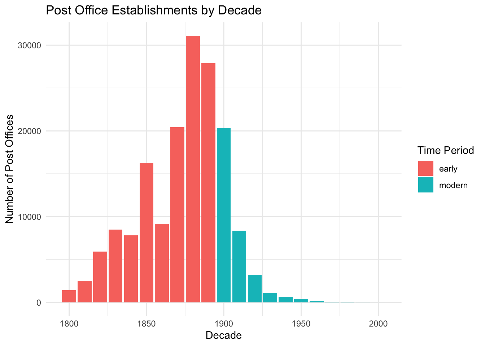
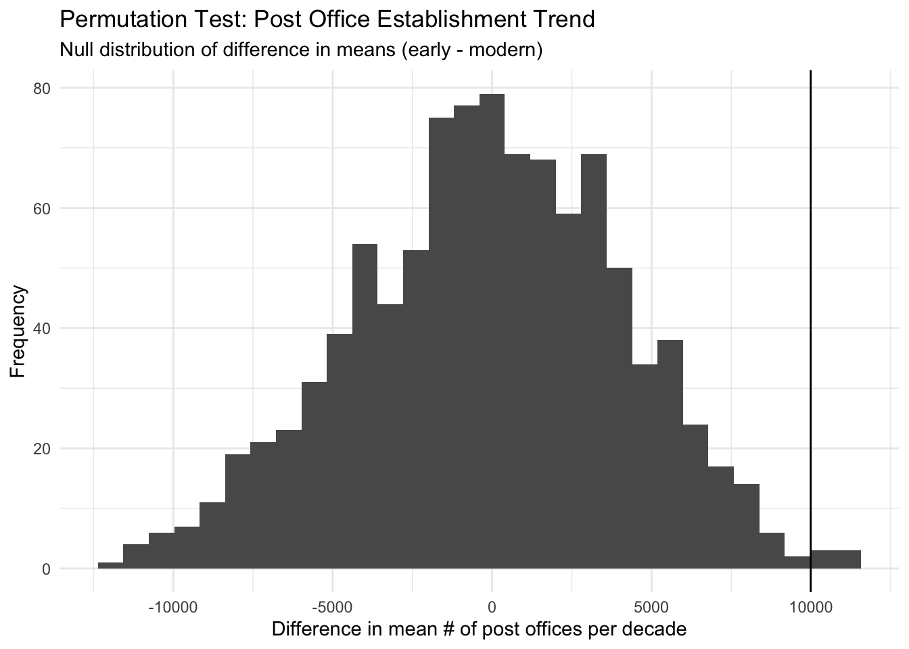

The data for this project of post offices that operated in the United States between 1639-2000 comes from Cameron Blevins and Richard W. Helbock in the Harvard Dataverse. For this project, I chose the first option which is conducting a permutation test by simulator behavior under the null hypothesis. Specifically, I sought to see whether the average number of post offices established on a per decade basis has decreased in recent years, specifically before 1900 compared to after 1900 until 2000.

This dataset provides context for how many post offices were implemented yearly since the birth of the U.S. I mutated another variable into established decade in order to group the amount of post offices built into a decade basis for easier visualization. Then, this data is grouped into an early time period which is before 1900 and then after 1900 which would be considered modern time.

Acknowledging the critical role post offices played in the development of the U.S., it is fascinating to visualize and interpret this data to see how the priority of post offices for vital communication and shipping may have changed in the past centuries. This is especially so since this data allows visualization of U.S. infrastructure growth in recent years as well as U.S. westward expansion.


::: {.cell}
::: {.cell-output-display}
{width=672}
:::
:::


In the plot above, we see the number of post offices built from 1800 to 2000. There is a clear surge in the 1800s with this number eventually dwindling down, fueling the hypothesis for this project since there may have been more of an emphasis in post offices in the 1800s.


::: {.cell}
::: {.cell-output .cell-output-stdout}

```
# A tibble: 6 × 3
  est_decade     n period
       <dbl> <int> <chr> 
1       1800  1436 early 
2       1810  2503 early 
3       1820  5944 early 
4       1830  8480 early 
5       1840  7829 early 
6       1850 16271 early 
```


:::

::: {.cell-output .cell-output-stdout}

```
[1] 9990.764
```


:::

::: {.cell-output-display}
{width=672}
:::

::: {.cell-output .cell-output-stdout}

```
[1] 0.005
```


:::
:::


In this histogram running our permutation test, we observe the null distribution of the difference in average post offices per decade between early and modern periods. This assumes "early" and "modern" have no real effect under the null hypothesis. Each bar is one of 1,000 simulated differences after the labels had been randomly shuffled.

The red dashed value is our observed value is quite far to the right, suggesting that a drastic difference is not likely just because of chance. This provides evidence for our hypothesis that the early period of the U.S. before 1900 had much more post office development than the modern period. This makes sense since U.S. historical expansion was quite concentrated in the 1800s as westward expansion was in its prime as well as the U.S. government attempting to spread out its infrastructure. mean(null_diffs \>= obs_diff)

The p-value being 0.005 means only 0.5% of the permuted differences were as large as the observed ones, rejecting the null hypothesis. This supports that the pre-1900s saw more growth in post offices than the modern period. This is an interesting glimpse into the early development of the United States and how the value of post offices may have shifted over the history of our country as well our priorities as a society.

